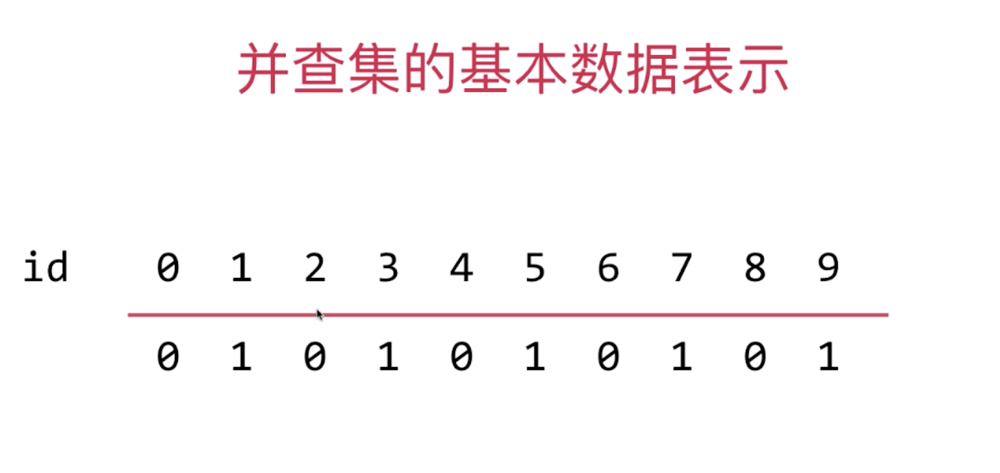
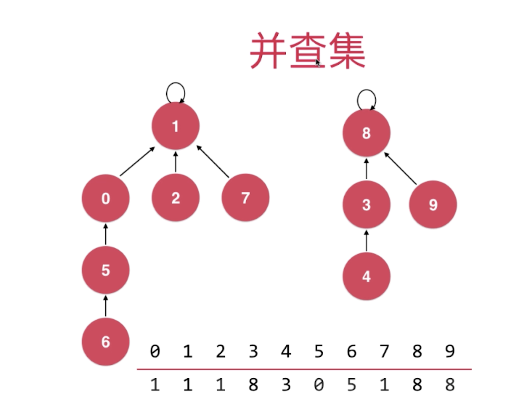
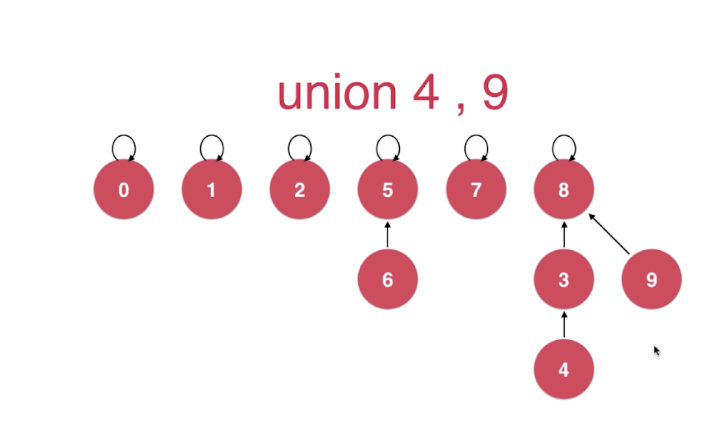
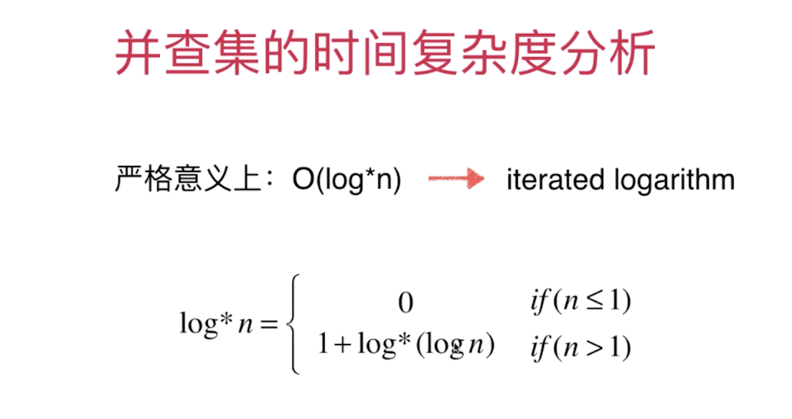

## Union FInd

### 第一种并查集 QuickFind
- Union:O(n) find:O(1) 

### 第二种并查集 QuickUnion
    
- Union:O(h) find:O(h)

### 并查集的优化基于size的

### 并查集的优化基于rank的

深度低的合并到深度高的

### 路径压缩 --- 基于find的压缩

而实际上，这个rank的作用，只是在union的过程中，比较两个节点的深度。换句话说，我们完全可以不知道每个节点具体的深度，只要保证每两个节点深度的大小关系可以被rank正确表达即可。而这个rank确实可以正确表达两个节点之间深度的大小关系。因为根据我们的路径压缩的过程，rank高的节点虽然被抬了上来（深度降低），但是不可能降低到比原先深度更小的节点还要小。所以，rank足以胜任比较两个节点的深度，进而选择合适的节点进行union这个任务：）

### 路径压缩 -- 递归压缩

