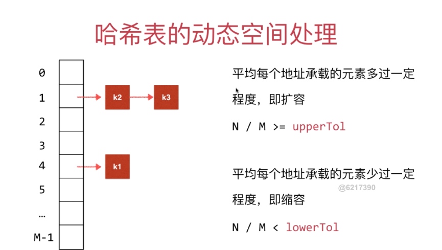

# Hash 表

## hash 冲突

很难保证每一个键 通过哈希函数的转换 对应不同的“索引”

哈希表充分体现了算法设计领域的经典思想：空间换时间

如果我们有999999999999999999的空间，我们可以用0（1）时间完成各项操作 

如果我们有1的空间，我们只能用o(n）时间完成各项操作（线性表）

hash 函数的设计很重要

“键”通过哈希函数得到的“索引”分布越均匀越好

## hash 函数设计

取模不均匀问题：模一个素数

字符串 处理为整数

### 原则
- 1.一致性：如果a：：b，则hash(a) =hash(b) 
- 2·高效性，计算高效简便 
- 3.均匀性：哈希值均匀分布

## hash 冲突解决问题
separate chaining 链地址表 查找表 TreeMap

### 开放地址法

- 线性探测 
遇到哈希冲突+1

- 平方探测 
遇到哈希冲突 +1+4+9+16

- 负载率 

#### coalesced Hashing