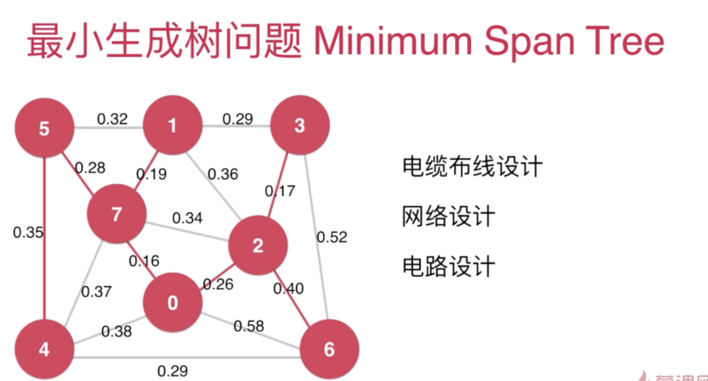
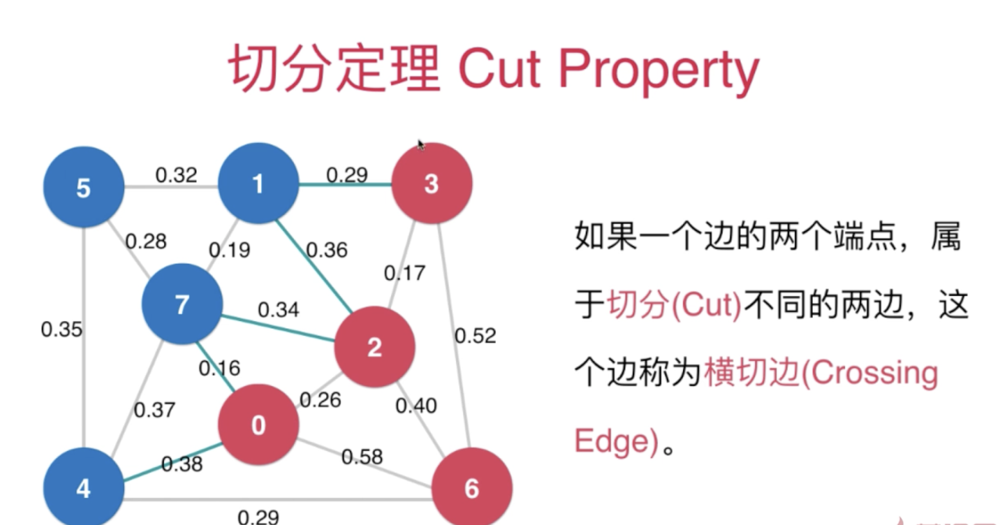
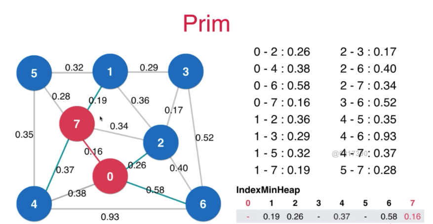
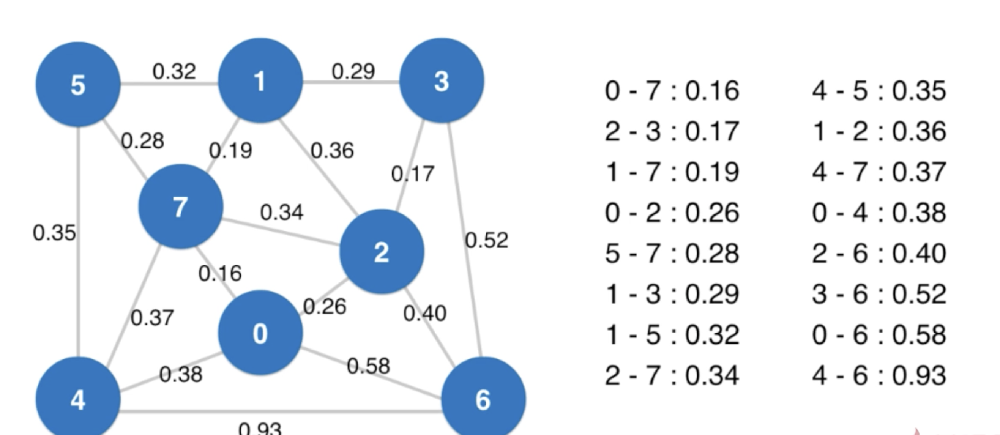
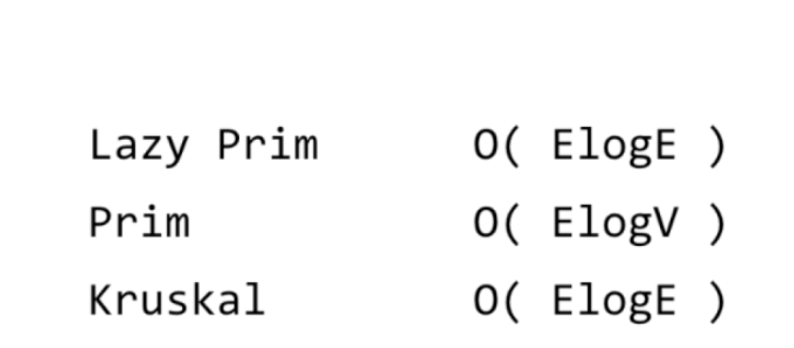

## 代权图

### 最小生成树的问题

Minimum Span Tree

#### 切分定理

切分定理： 给定任意切分，横切边中全值 最小的边必然属于最小生成树。

### Prim 算法 

#### Lazy Prim
O(VlogV)

#### Prim 算法 -- 索引堆

OElogV

### Krusk 算法

##### 不断的找最短的边,只要这些边不能构成环 -- UnionFind

