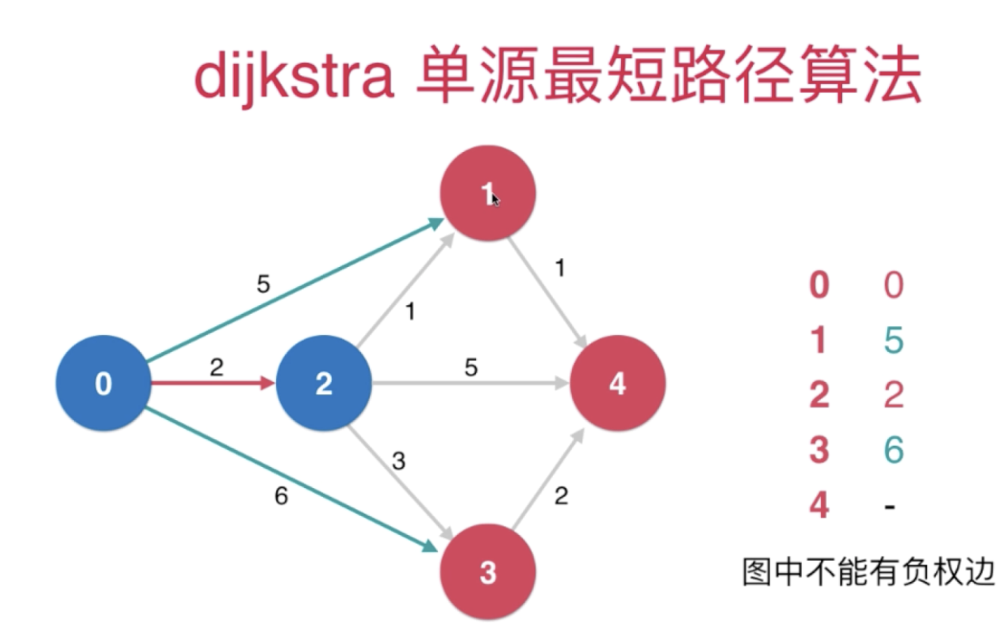
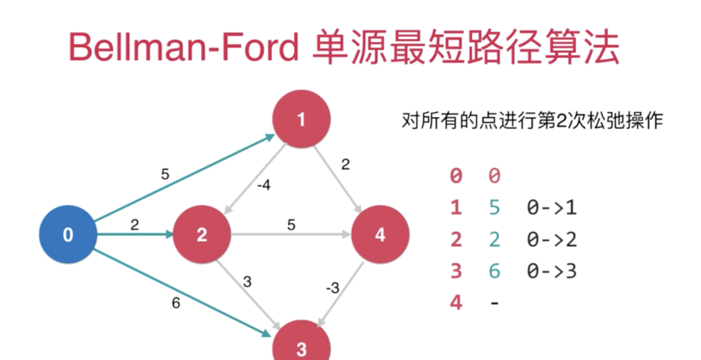
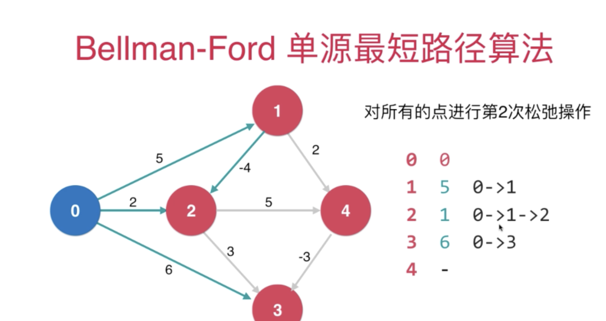

## 代权图的另一大问题

### 最短路径问题 -- Dijkstra算法
- 前提：图中不能有负权边，单源最短路径

复杂度O(Elog(V)）

算法思想：每次找找到最短的边，最短的边另外一个端点的其他边寻找在索引堆中最小的跟新索引堆
肯定是最小值，因为都是正值，经过这个节点只会增加

### 最短路径的问题 -- Bellman-Ford

- 前提：可以有负权边，但是不能有负权环。拥有负权环的图， 没有最短路径
复杂度O(EV）

如果一个图没有负权环， 从一点到另外一点的最短路径，最多经过所有的v个顶点，有v·1条边 否则，存在顶点经过了两次，既存在负权环

对所有的点进行v·1次松弛操作，理论上就找到了从源点 到其他所有点的最短路径。 如果还可以继续松弛，所说原图中有负权环。